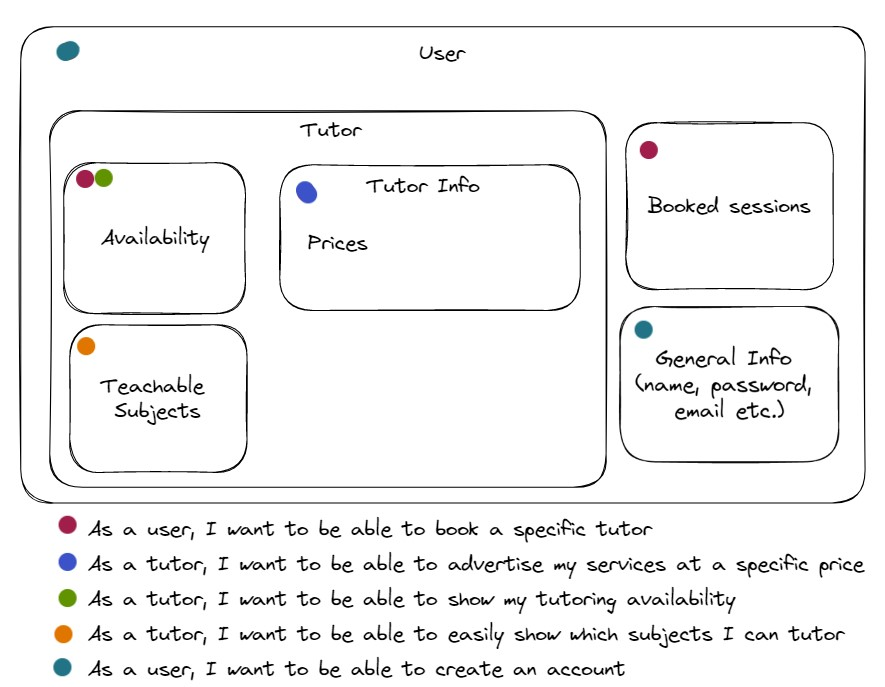

# Assignment 4
All elements of assignment 4 are linked below in the [decimal-dogs-5](https://github.com/uvic-seng321/project-decimal-dogs-5) GitHub repo :)

## Must Have User Stories
Here is a link to our must have user stories: [Must Have's](https://github.com/uvic-seng321/project-decimal-dogs-5/labels/Must%20have)

Here is a list of our must have user stories and a link to the acceptance criteria for each: \
[As a user, I want to be able to book a specific tutor](https://github.com/uvic-seng321/project-decimal-dogs-5/issues/10) \
[As a tutor, I want to be able to advertise my services at a specific price](https://github.com/uvic-seng321/project-decimal-dogs-5/issues/8) \
[As a tutor, I want to be able to show my tutoring availability](https://github.com/uvic-seng321/project-decimal-dogs-5/issues/6) \
[As a tutor, I want to be able to easily show which subjects I can tutor](https://github.com/uvic-seng321/project-decimal-dogs-5/issues/5) \
[As a user, I want to be able to create an account](https://github.com/uvic-seng321/project-decimal-dogs-5/issues/26)

## Data model sketch:

## Backend design sketch:

##

## Individual Acceptance Criteria
### As a user, I want to be able to book a specific tutor
Tutor availability should be updated when a tutor is booked:
```python
from app import *
from datetime import datetime

def test_add_booking():
    date = datetime.now()

    data_json = {
        "tutorID": 1,
        "studentID": 1,
        "date": date.strftime("%Y-%m-%d %H:%M:%S"),
        "startTime": "10:00",
        "endTime": "11:00"
    }

    app.test_client().post('/addBooking', json=data_json)
    result = app.test_client().get('/getAvailability/1')
    
    assert date.strftime("%d %b %Y") in result.data.decode()
```
Users should be able to select a specific tutor: Not tested as this is a frontend feature \
When a tutor has been selected, the user should be able to pick an existing time from the tutor's availability:
```python
from app import *
import json

def test_get_availability():
    response = app.test_client().get('/getAvailability/1')
    keys = ["Monday", "Tuesday", "Wednesday", "Thursday", "Friday", "Saturday", "Sunday"]

    schedule = json.loads(response.data.decode())['schedule']
    for key in keys:
        assert key in schedule
        
    assert "bookings" in json.loads(response.data.decode())
```
When a tutor is booked, an email should be displayed: Not tested as this is a frontend feature

### As a tutor, I want to be able to advertise my services at a specific price
Price is in the correct currency (CAD): Not the currency part, but getting the price test is below
```python
from app import *
def test_get_tutor_price():
    response = app.test_client().get('/getTutorPrice/1')
    assert str(response.data.decode()) == "30.0"
```
Tutor must be able to update the price when they please
```python
from app import *
def test_set_tutor_price():
    app.test_client().get('/setTutorPrice/2/35.0')
    assert str(getTutorPrice(2)) == "35.0"
```
If I lower the price it should show what the previous price was to make my ad more enticing: Not tested as this is a frontend feature

### As a tutor, I want to be able to show my tutoring availability
Must correctly show tutor availability:
```python
from app import *
import json

def test_get_availability():
    response = app.test_client().get('/getAvailability/1')
    keys = ["Monday", "Tuesday", "Wednesday", "Thursday", "Friday", "Saturday", "Sunday"]

    schedule = json.loads(response.data.decode())['schedule']
    for key in keys:
        assert key in schedule
        
    assert "bookings" in json.loads(response.data.decode())
```
Must be able to update tutor availability: 
```python
from app import *
import json

def test_get_availability():
    response = app.test_client().get('/getAvailability/1')
    keys = ["Monday", "Tuesday", "Wednesday", "Thursday", "Friday", "Saturday", "Sunday"]

    schedule = json.loads(response.data.decode())['schedule']
    for key in keys:
        assert key in schedule
        
    assert "bookings" in json.loads(response.data.decode())
```
Must display in calendar view: This will be a frontend feature

### As a tutor, I want to be able to easily show which subjects I can tutor
Must be able to create a list of subjects: Not yet\
Must be able to update the subjects I offer:
```python
from app import * 
from get_subjects import *

def test_show_subjects(): 
    email = "fred@murphy.ca"
    response = show_subjects(email) 
    print(response)
    assert response == "SENG"

def test_show_subjects2(): 
    email = "jeff@smith.ca"
    response = show_subjects(email) 
    print(response) 
    assert response == "CIVE"
```

### As a user, I want to be able to create an account
Created account must show up in database:
```python
import json
from app import *
from new_users import *

def test_student_exists():
    stu_id = get_student_id("roman reigns")
    
    assert stu_id == 1
```
## Tracability Matrix
| User Stories | test_get_tutor_price.py | test_set_tutor_price.py | test_add_booking.py | test_get_availability.py | test_get_subjects.py | test_show_subject.py | test_student_exists.py |
|--------------|-----------------------|------------------------|---------------------|--------------------------|-----------------------|----------------------|-------------------------|
| As a user, I want to be able to create an account. |  |  |  |  |  |  | ✔️ |
| As a student, I want to be sure my tutor is qualified. |  |  |  |  |  |  |  |
| As a student, I want to see what free assistance services are available. |  |  |  |  |  |  |  |
| As a user, I want to be able to book a specific tutor. |  |  | ✔️ | ✔️ |  |  |  |
| As a student, I want to find a tutor who can help me twice a week. |  |  |  |  |  |  |  |
| As a tutor, I want to be able to advertise my services at a specific price. | ✔️ | ✔️ |  |  |  |  |  |
| As a student, I want to find an in-person tutor. |  |  |  |  |  |  |  |
| As a tutor, I want to be able to show my tutoring availability. |  |  |  | ✔️ |  |  |  |
| As a tutor, I want to be able to easily show which subjects I can tutor. |  |  |  |  | ✔️ | ✔️ |  |
| As a student, I want to be able to filter tutors based on the subjects they can tutor. |  |  |  |  |  |  |  |
| As a student, I want to find a tutor for under a specified rate. |  |  |  |  |  |  |  |
